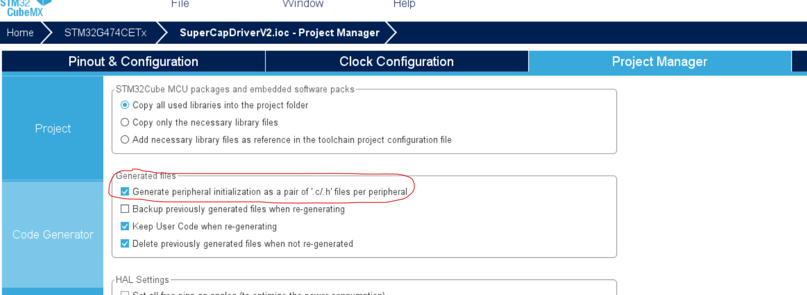

# 嵌入式代码规范

- 工程文件结构
- 函数注释
- 可移植性和健壮性
- 文件权限和留名
  
## 工程文件结构

基础CubeMX生成的工程
- 首先，生成工程时，勾选“对每个外设分别生成初始化文件”，
- 在工程中，“main.c”等文件默认存放在“./MDK-ARM/”目录下
- BSP文件夹和操作系统线程（任务）文件夹放在根目录下
- 根目录下，添加“REFERENCE”文件夹，存放相关参考资料
- 最后，给出示例如下

```
--+ Project
    --+ Drivers
    --+ inc
    --+ MDK-ARM
    --+ Middlewares
    --+ Src
    --+ Task
    --+ BSP
    --+ REFERENCE
        --+ link.md
        --- ...
    --+ Project.ioc
    --+ README.md
```

## 函数注释

- 声明函数时，需要对函数的功能、参数、返回值进行说明，并且注上作者和联系方式

```C
/**
    * @brief  初始化W25Q256芯片
    * @note   调用该函数前必须已经初始化了QSPI外设，FLASH芯片上电后默认SPI传输模式
    * @author 江榕煜（V1），周森（V2）
    * @param  None
    * @retval 初始化是否成功，HAL_OK或者HAL_ERROR
    */
HAL_StatusTypeDef FLASH256devInit(void);
```

- 函数编写时，写清逻辑关系

```C
if (rc_device_get_state(&rc, RC_S2_UP))				//若sw2为UP，底盘跟随云台，云台两轴角度由遥控器控制
{
            pgimbal->gimbal_init.step=GIMBAL_CALI_START_STEP;
    pit_delta = -rc.ch4 ;		//遥控器通道4为pit轴增量（pit角速度）
    yaw_delta = -rc.ch3;		//遥控器通道3为yaw轴增量（yaw角速度)
    gimbal_set_pitch_delta(pit_delta);			//改变云台pit轴目标角度
    gimbal_set_yaw_delta(yaw_delta);				//改变云台yaw轴目标角度				
}
```

- 注意代码对齐
- 注意，代码中不理解的，或者有bug的，必须注明！

## 可移植性和健壮性

- 多使用宏定义和HAL句柄
- 可变参量使用宏定义
- 有能力考虑条件编译，使得代码更加强大
- 该部分参考代码：[参考FLASH驱动](https://github.com/studyHooligen/device_drvFiles/blob/master/FLASH/FLASH_W25Q256.h)

## 文件权限和留名

- 文件类型文件用途
- 文件使用时要注意的
- 说明文件属于团队or你个人
- 证书声明（如果你用的话）
- 创作/修改者的留名
```C
/* 
 * FLASH_W25Q256.h - The C head file of the SPI FLASH(W25Q256) driver
 * NOTE: This file is based on HAL library of stm32 platform
 *       The default initialization device is in QSPI mode!!!
 *
 * Copyright (c) 2020-, FOSH Project
 *
 * SPDX-License-Identifier: Apache-2.0
 *
 * Change Logs:
 * Date           Author            Notes           mail
 * 2020-03-20     StudyHooligen     first version   2373180028@qq.com
 */
#ifndef _FLASH_W25Q256_H_

#define _FLASH_W25Q256_H_
```